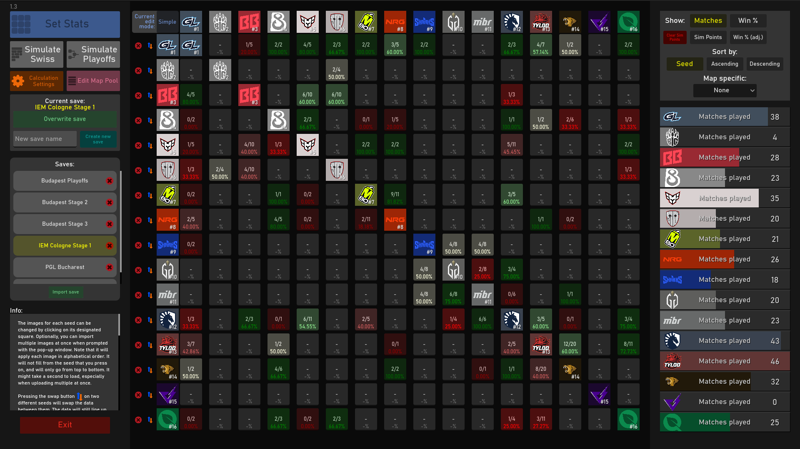
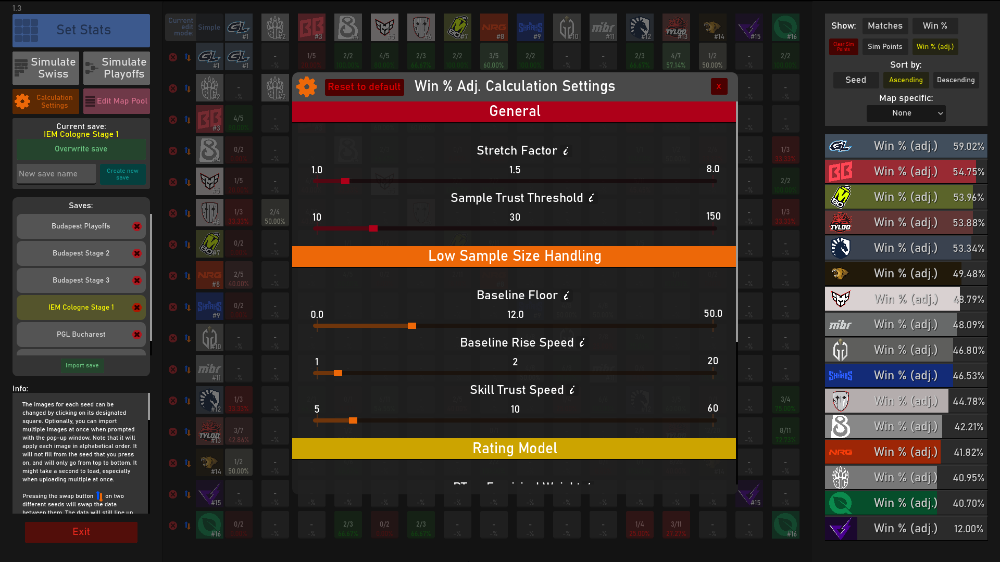
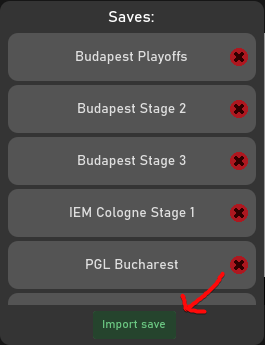

# Swiss-Auto-Simulator
Project that simulates the results of the 16 seed Swiss tournament format (Buchholz system) based on user inserted statistics.
## About this project:

I created this as a way to make predictions for Picks Ems in Counter-Strike 2. As of now, it only follows the games current format of Swiss as seen [here](https://github.com/ValveSoftware/counter-strike_rules_and_regs/blob/main/major-supplemental-rulebook.md).

I have left some basic information about how the project works and how to use it within the program. Feel free to reach out for any problems or questions you have and I will get back to you. 

You can access the web version of the project here:
https://elijahlflowers.github.io/Swiss-Auto-Simulator/
## Example images
### Stats of teams at Stage 1 of IEM Cologne 2026

(stats gathered from [HLTV.org](https://www.hltv.org/events/8042/starladder-budapest-major-2025)):
### Map stats editor

### Calculation Settings

### Swiss simulator

### Playoffs simulator

## How to import saves:

A list of example save files is located in the ExampleSaves folder of this project. After downloading it, you can use any of the following methods to import it into the program. A template save file will come loaded upon launching the program as well, without the need to download anything. 
### Download version:

#### Method 1 - Manual import:
Insert the .json file(s) into the following folder:
C:\Users\YourName\AppData\Roaming\Godot\app_userdata\Swiss Auto Simulator\Saves

The program must be restarted if using this method. If it works, you should be able to see the save populated in the list within the program.

#### Method 2 - Auto import:
Above the list of saves, press the 'Import save' button. A file dialog should appear, from here you can select multiple .json save files to upload. The files should automatically appear in the list, if the file was valid.

### Web version

In the web version, there is no list of save files, so everything must be downloaded and loaded to and from your computer directly. Importing works in a similar way to Method 2 above, except you can only import 1 save. 

