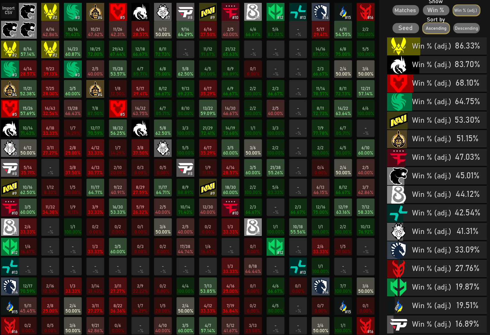
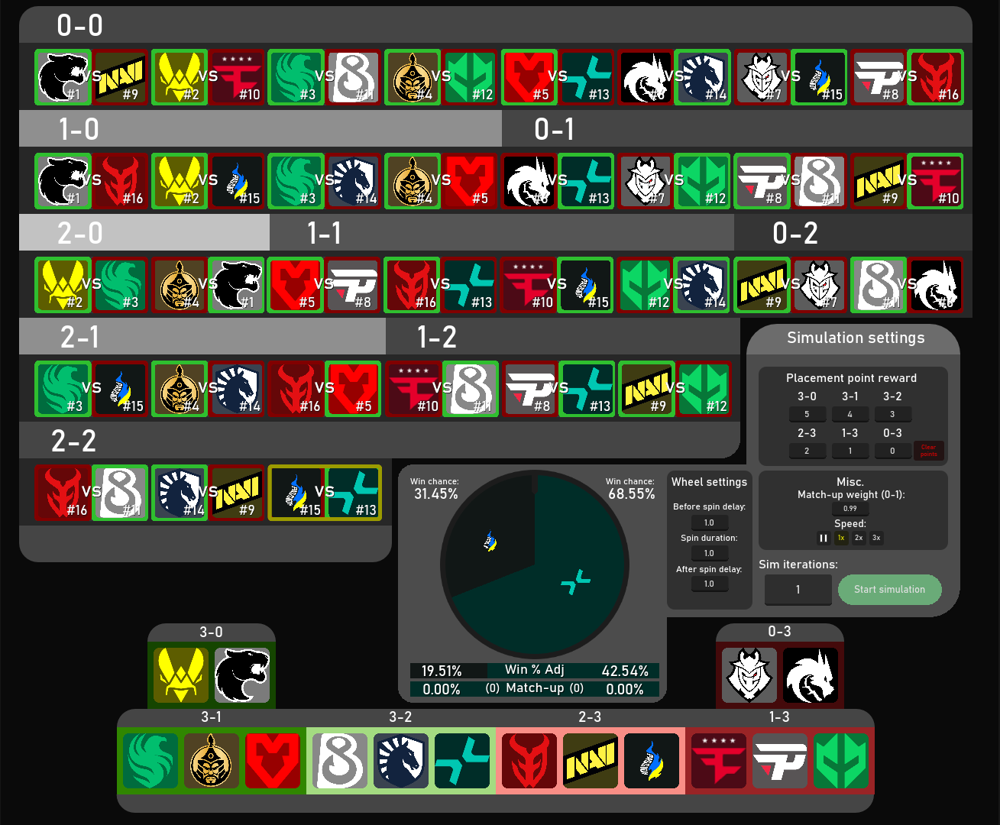
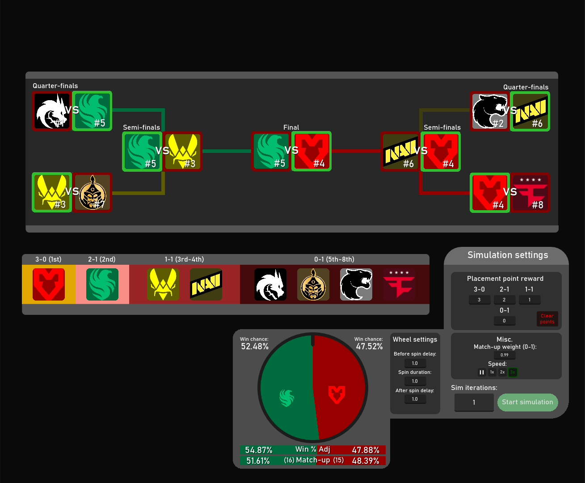

# Swiss-Auto-Simulator
Project that simulates the results of the 16 seed Swiss tournament format (Buchholz system) based on user inserted statistics.

## About this project:

Firstly, I initially created this as a way to make predictions for Picks Ems for Counter-Strike 2 majors. As of now, it only follows the games current format of Swiss as seen [here](https://github.com/ValveSoftware/counter-strike_rules_and_regs/blob/main/major-supplemental-rulebook.md). I will potentially release updates for other formats as well, in the future or make it open source, but as it stands the project still needs a bit of cleaning up before I do so. It is made in Godot/gdscript, as the UI capabilities are easy to understand, and easily interchangeable. 

Secondly, as much I have made an attempt at an accurate prediction software, please note that nothing about the results of the simulation are guaranteed to be accurate to reality. At the end of the day, stats cannot predict everything, as much this project tries to account for randomness. I highly recommend that you don't use the results of this software to gamble real money, but if you decide you're going to anyways, please gamble responsibly. 

Lastly, I will try to explain more in-depth on how some of the values found in the project are calculated and utilized in the simulation process.

## Example images

## How it works:
(work in progress)