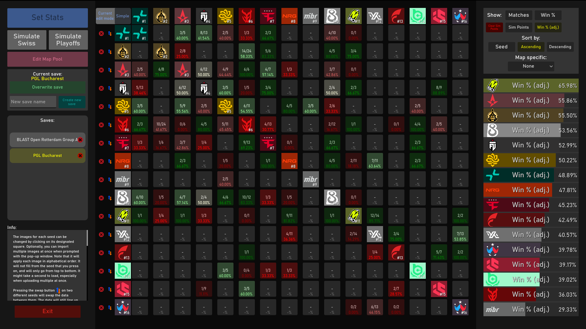
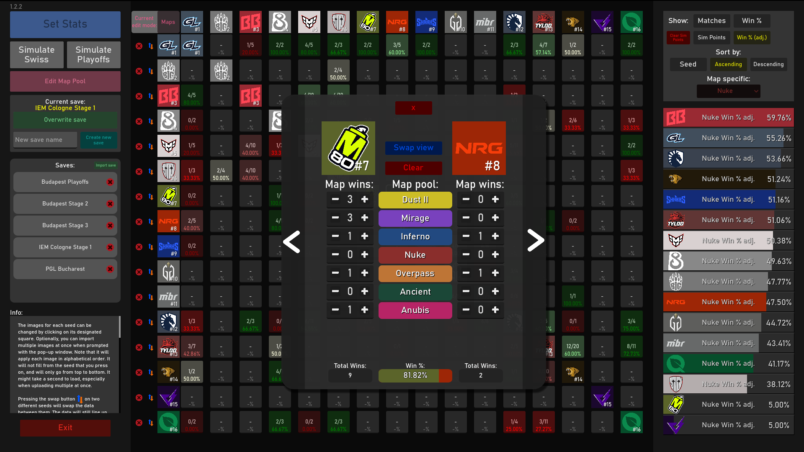
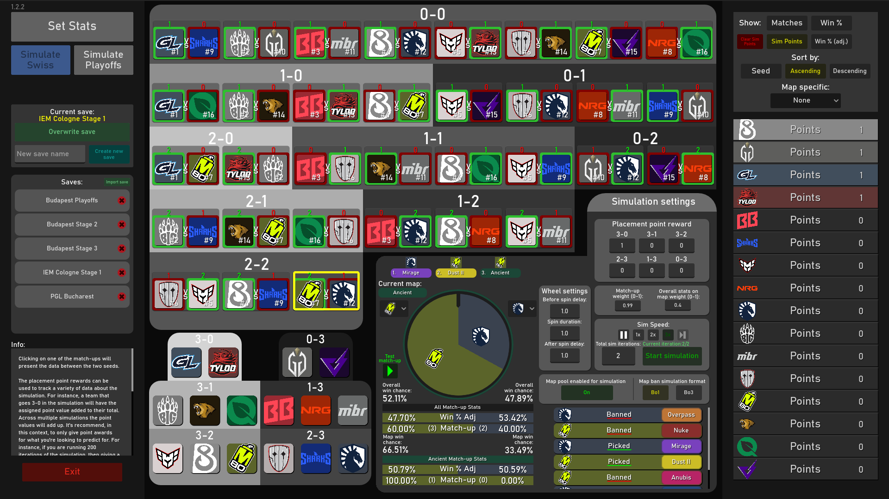
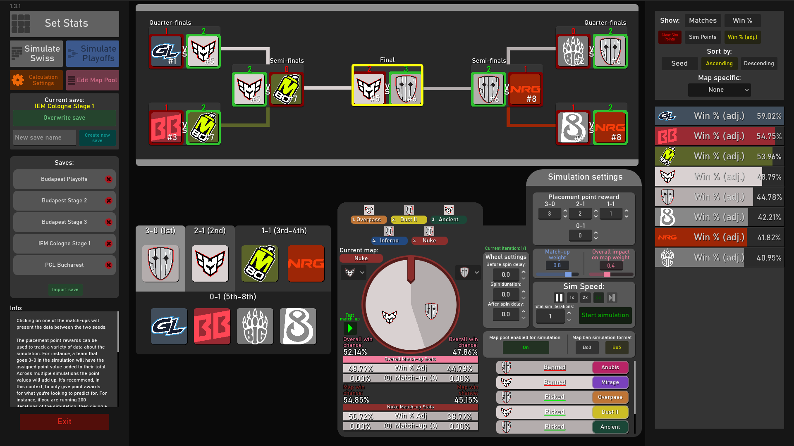
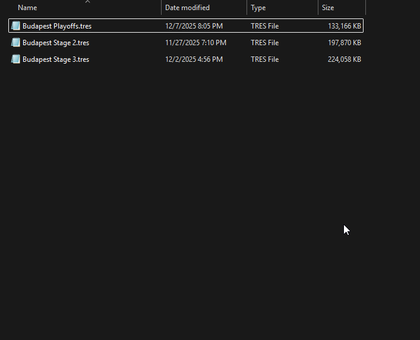

# Swiss-Auto-Simulator
Project that simulates the results of the 16 seed Swiss tournament format (Buchholz system) based on user inserted statistics.
## About this project:

I created this as a way to make predictions for Picks Ems in Counter-Strike 2. As of now, it only follows the games current format of Swiss as seen [here](https://github.com/ValveSoftware/counter-strike_rules_and_regs/blob/main/major-supplemental-rulebook.md).

I have left some basic information about how the project works and how to use it within the program. Feel free to reach out for any problems or questions you have and I will get back to you. 

You can access the web version of the project here:
https://elijahlflowers.github.io/Swiss-Auto-Simulator/
## Example images
### Stats of teams at the PGL Bucharest 2026

(stats gathered from [HLTV.org](https://www.hltv.org/events/8042/starladder-budapest-major-2025)):
### Map stats editor

### Swiss simulator

### Playoffs simulator

## How to import saves:

Insert the .tres file into the following folder:
C:\Users\yourname\AppData\Roaming\Godot\app_userdata\CS2MajorPredictor\Saves

If it works, you should be able to see the save populated in the list within the program.

