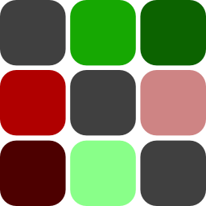
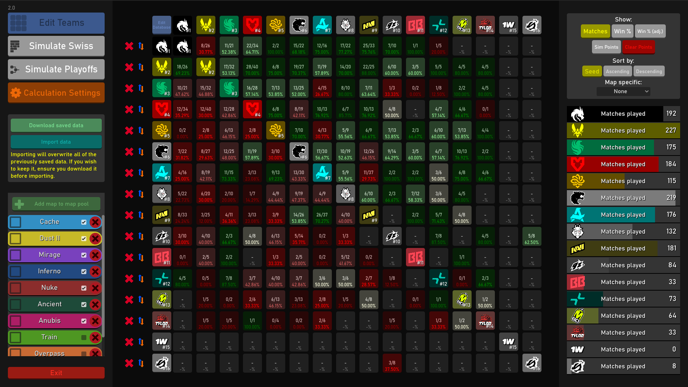
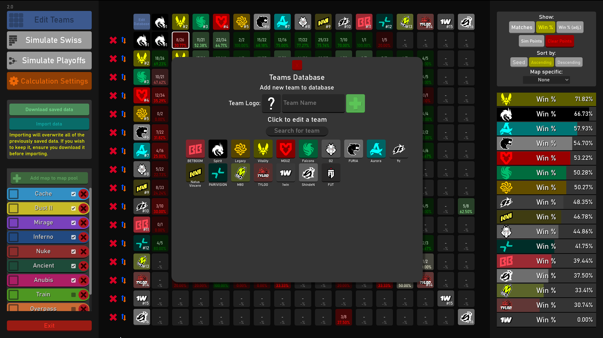
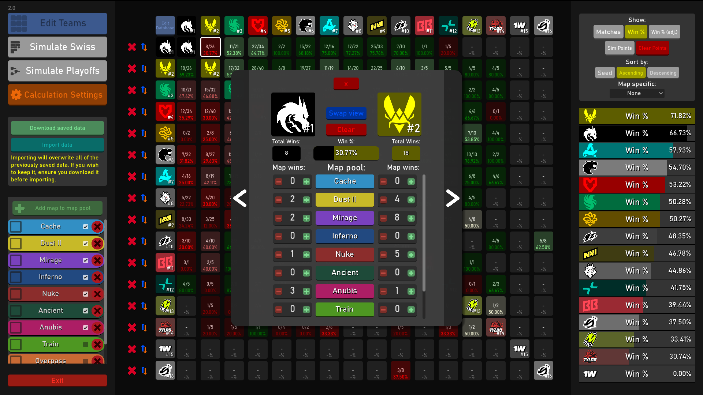
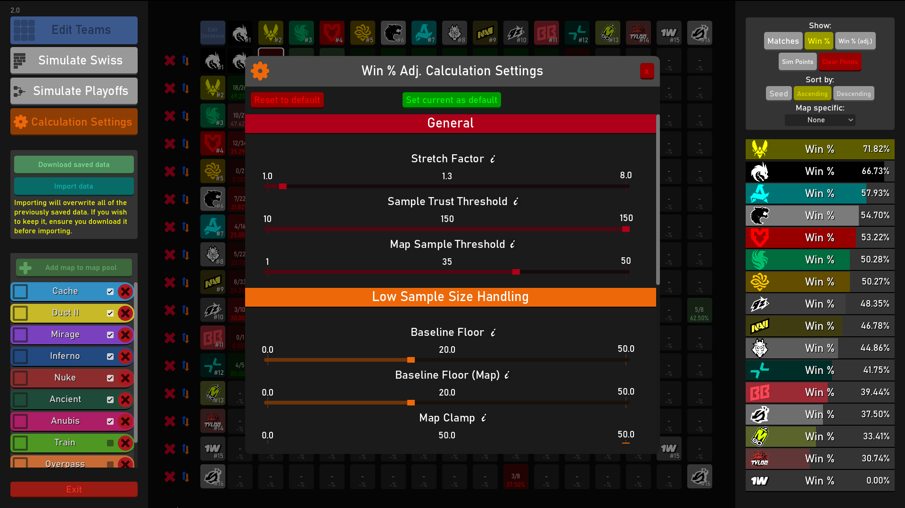
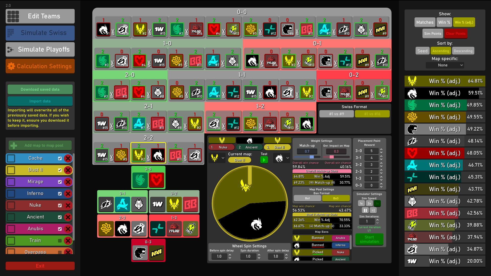
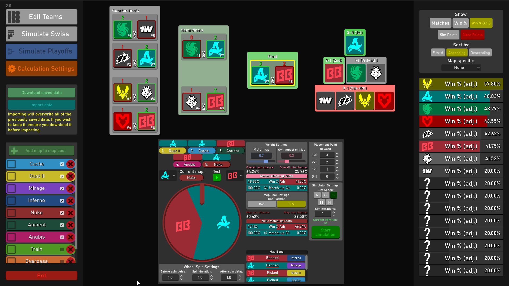

# Swiss Auto Simulator

Project that simulates the results of the 16 seed Swiss tournament format (Buchholz system) based on user inserted statistics.
## About this project:

I created this as a way to make predictions for Picks Ems in Counter-Strike 2. As of now, it only follows the games current format of Swiss as seen [here](https://github.com/ValveSoftware/counter-strike_rules_and_regs/blob/main/major-supplemental-rulebook.md).

It utilizes the head-to-head data between cores (at least 3 players of a team) to calculate a customizable win percent value. It also contains specific win percent values for each map in the map pool. These values are used in the simulation to determine the odds of one team winning over another. This result will be used across the entire Swiss bracket. The bracket can be simulated many times in succession, with a point scoring system to allow you to see the results after multiple simulations. 

There is plenty of customizability within the project to allow you to tweak the values, or simulation process as you wish. In no way is this project meant to be a perfect predictor, as many more factors go into the real results than the data being used. The best use case is not to take the results at face value, but rather to detect a pattern or to give you more insight as to what the most likely Swiss matchups may be.

The project has an updating database of teams that are attending events with the Swiss format (plan to add other event formats in the future). New teams will be added overtime, and new results will be reflected in the existing team head to heads. All of the data is being manually added by me, since there isn't a way to ethically scrape the data from anywhere (that I am aware of). I will be using [HLTV](https://hltv.org) to get all of my data, and will do my best to ensure accuracy in my collection. You have to ability to add your own teams and results as well though, so it will always be possible to maintain the data yourself. 

There is a downloadable exe version [here](https://github.com/elijahlflowers/Swiss-Auto-Simulator/releases) or you can access the web version of the project [here](https://elijahlflowers.github.io/Swiss-Auto-Simulator/)

You can also find some other related tools I've created at [cs2ools.blue](https://cs2ools.blue/)

Feel free to reach out with suggestions or issues you may have!
## Screenshots
### Edit Teams

### Teams Database

### Map Stats Editor

### Calculation Settings

### Swiss Simulator

### Playoffs Simulator

